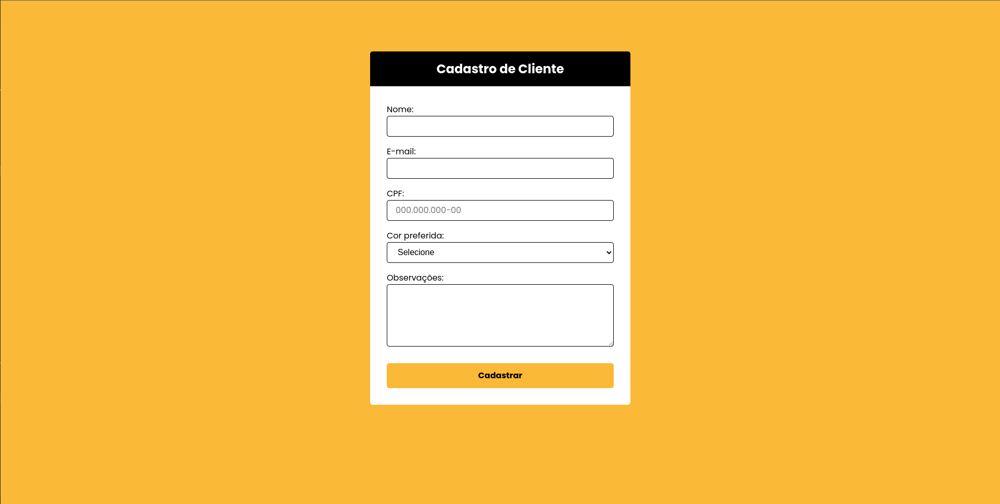
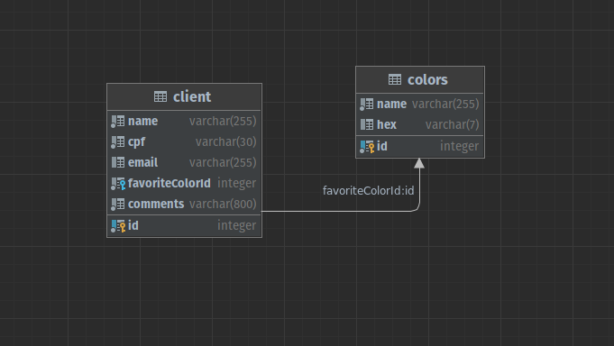

## Informações

Projeto desenvolvido para teste de conhecimento em ReactJS e NodeJS.

## Algumas imagens do projeto

 

#### Formulário de cadastro de clientes:

 

#### Diagrama representando a estrutura do banco de dados:

 
 

## Ferramentas utilizadas

### FrontEnd

<li>ReactJS</li>
<li>TypeScript</li>
<li>Styled-Components</li>
<li>React-Hook-Form</li>

### BackEnd

<li>NodeJS</li>
<li>TypeScript</li>
<li>Express</li>
<li>Postgres</li>
